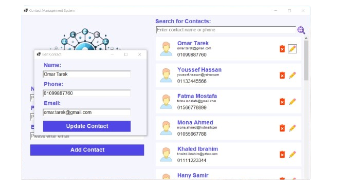
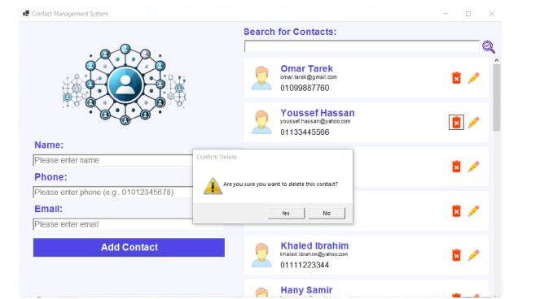

# Contact Management System

## 📜 Project Description

A powerful **Contact Management System** built using **F#** with a Windows Forms UI. This application allows users to manage their contacts seamlessly with features like adding, updating, searching, and deleting contacts.

---

## ✨ Features

1. **Add Contact:**  
   Add new contacts with validation for name, phone, and email.

2. **Search Contact:**  
   Quickly search for contacts by name or phone number.

3. **Update Contact:**  
   Edit existing contact details with live validation.

4. **Delete Contact:**  
   Remove a contact with a confirmation dialog.

5. **Modern UI:**  
   User-friendly design with a responsive and modern look.

---

## 🖥️ How to Run

1. Clone the repository:
   ```bash
   git clone https://github.com/Abdelrahmankhaled12/Contact_Management_System.git
   ```
2. Open the project in your favorite **F# IDE** (e.g., Visual Studio or JetBrains Rider).
3. Ensure you have the required .NET SDK installed.
4. Run the project.

---

## 🔧 Prerequisites

1. **.NET SDK**: Version 6.0 or later.
2. **Windows Forms Framework**: Installed with Visual Studio.
3. **F# Development Tools**: Installed in your IDE.

---

## 📷 Screenshots

### 1. **Add Contact**


### 2. **Search Contacts**


### 3. **Update Contact**


### 4. **Delete Contact**


---

## 💡 How It Works

1. **Add Contact:**
   - Fill in the name, phone number, and email fields.
   - Click "Save Contact."
   - Contact is added to the list and saved in `contacts.txt`.

2. **Search Contact:**
   - Enter the name or phone number in the search field.
   - Results are filtered dynamically.

3. **Update Contact:**
   - Click the edit button beside a contact.
   - Modify the details and click "Save."

4. **Delete Contact:**
   - Click the delete button beside a contact.
   - Confirm the deletion in the dialog.

---

## 🙏 Acknowledgments

Special thanks to **[Your Name]** for developing this fantastic project and making contact management simple and intuitive.

If you enjoy this project or have suggestions, feel free to contribute or leave a ⭐ on the repository!

---

## 📝 License

This project is licensed under the **MIT License**.
